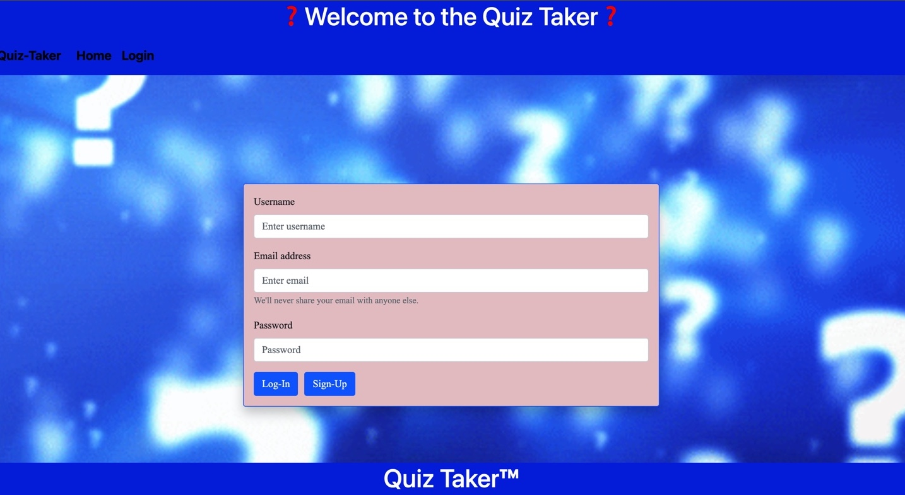
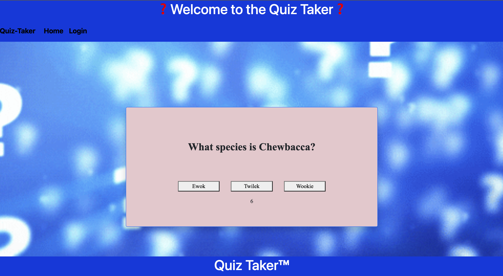
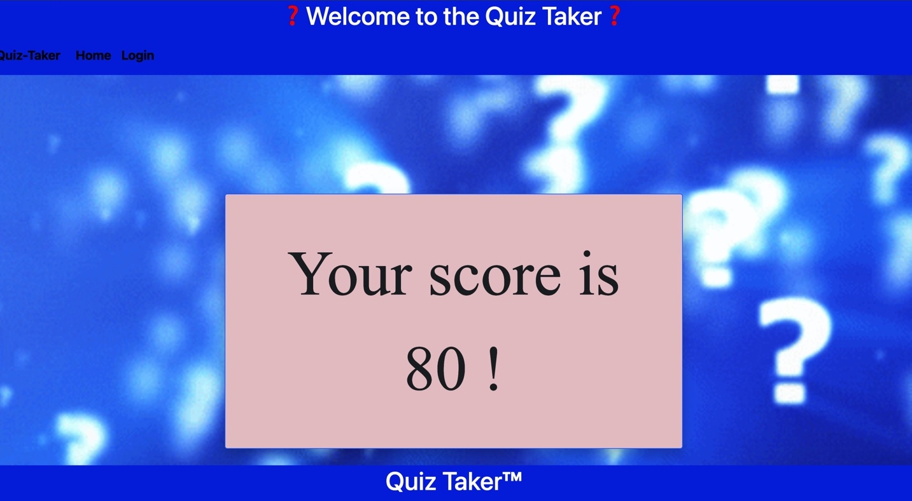

# Quiz Creator! #

 ## Table of Contents
* [Description](#description)
* [Installation](#installation)
* [Usage](#usage)
* [Contributors](#contributors)
* [Website](#website)
* [ScreenShots](#screenshots)
* [Questions/Contact](#questions/contact)
* [License](#license)

## Description:

Quiz-Creator is the place for all quiz lovers to find quizzes and take them! With a variety of quizzes, users can find anything that peaks their interest and test their scores among other users! Quiz-Creator uses both front and back end technologies to create a user friendly application. 

## Install:

Make sure to clone the repo, then in the root directory run npm install (mongoose, express, react, bootstrap).

## Usage:

Quiz-Creator allows for users to go to our site and take quizzes based on different categories of their liking. 

## Contributors:

Christopher Tangarife

Katie Gendaszek

Noel Ramirez

Tyrese Exantus

## Website:

[GithubRepo](https://github.com/trealtye20/quiz-creator)

[DeployedSite](https://quiz-taker-kg.herokuapp.com/)

## ScreenShots:

## Questions/Contact:
If you have any questions about the application contact any of us directly at:

Chris: Christangarife95@gmail.com 

Katie: katieshake27@gmail.com

Noel: rnoel2125@gmail.com

Tyrese: exantustyrese10@gmail.com

# GitHub:
Check out all of our other works on our respective Github accounts:

 [Chris](https://github.com/ChrisCodes54)

 [Katie](https://github.com/kgendaszek)

 [Noel](https://github.com/Namagaii)

 [Tyrese](https://github.com/trealtye20)

## License:

### 

[MIT license](LICENSE)